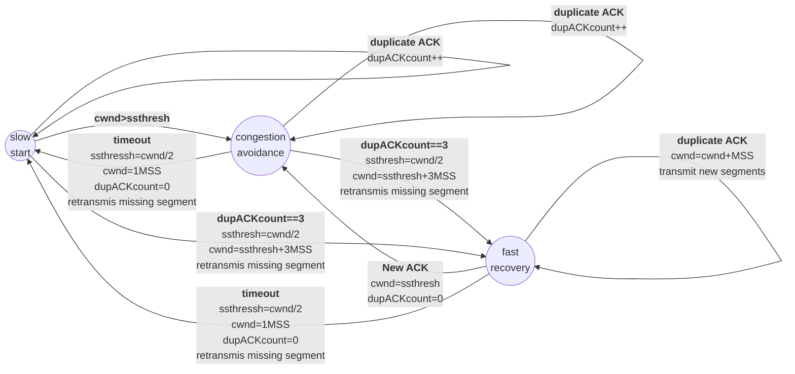

# 实验三：基于 UDP 服务设计可靠传输协议并编程实现

- 姓名 : 马永田
- 年级 :  2020 级
- 专业 : 计算机科学与技术
- 指导教师 : 张建忠 & 徐敬东

## 实验要求

在实验3-2的基础上，选择实现一种拥塞控制算法，也可以是改进的算法，完成给定测试文件的传输。

1. RENO算法；

2. 也可以自行设计协议或实现其他拥塞控制算法；

3. 给出实现的拥塞控制算法的原理说明；

4. 有必要日志输出（须显示窗口大小改变情况）。


## 拥塞控制算法设计

### 滑动窗口

对于**发送方的窗口**，如下图为发送方缓存的数据，根据处理的情况分成四个部分，其中深蓝色方框是发送窗口，紫色方框是可用窗口：


如下图，当发送方把数据全部都一下发送出去后，可用窗口的大变小为 0 ，表明可用窗口耗尽，在未收到 ACK 确认之前无法继续发送数据。


如下图，当收到之前发送的 `32~36` 分组的 ACK 确认应答后，**滑动窗口往右边移动 5 ，因为有 5 个分组被应答确认**，接下来 `52~56` 又变成了可用窗口，继续发送 `52~56` 这 5 个分组。


而对于接收方，实际接收窗口为1，由于设置了固定的**累积确认**大小， 因此也可看做是一个累积窗口，根据处理的情况划分成三个部分：

- \#1 + #2 是已成功接收并确认的数据（等待应用进程读取）；
- #3 是未收到数据但可以继续接收并累积的数据；
- \#4 未收到数据并处于下一次累积的数据；


通过一个确认指针(图中为32)，接收方能够只按序接收数据，当确认指针到达累积窗口末端时(图中为51)，发送ACK确认累积窗口中的所有数据，而当收到乱序的数据时：

1. 若该数据处于#1+#2部分，即小于确认指针，则表示已正确接收，直接丢弃
2. 若该数据大于当前的确认指针，提前接收到了后续的包，即发生了丢包事件(也可能只是来慢了)，立即停止累积直接发送ACK确认

### 慢启动 Slow Start

当`cwnd`的值小于`ssthresh`（slow start thresh，慢启动门限值）时，发送端处于`slow start`阶段，每收到一个ACK，`cwnd`的值就会加1。实际慢启动并不慢，经过一个RTT的时间，`cwnd`的值就会变成原来的两倍，实为指数增长。

### 拥塞避免 Congestion Avoidance

当`cwnd`的值超过`ssthresh`时，发送端就会进入**Congestion Avoidance**阶段，在该阶段下，`cwnd`以线性方式增长，大约每经过一个RTT，`cwnd`的值就会加1

### 快重传 Fast Retransmit

按照拥塞避免算法中`cwnd`的增长趋势，迟早会造成拥塞（一般通过是否丢包来判断是否发生了拥塞）。如果中网络中发生了丢包，通过等待一个RTO时间后再进行重传，是非常耗时的，因为RTO通常设置得会比较大（避免伪重传：不必要的重传）。
**快重传的思想是**：只要发送方收到了三个重复的ACK，就会立马重传，而不用等到RTO到达（如果没有3个重复的ACK而包丢失了，就只能超时重传）；并且将`ssthresh`的值设置为当前`cwnd`的一半，而`cwnd`减为1，重回**slow start**阶段。

### 快速恢复 Fast Recovery

当收到三个重复的ACK或是超过了RTO时间且尚未收到某个数据包的ACK，Reno就会认为丢包了，并认定网络中发生了拥塞。Reno会把当前的`ssthresh`的值设置为当前`cwnd`的一半，但是并不会回到`slow start`阶段，而是将`cwnd`设置为（更新后的）`ssthresh`+3MSS，之后每收到一个收到冗余ACK，`cwnd`大小增加一。

如果收到新的ACK，表明重传成功，退出快速恢复算法。将`cwnd`设置为`ssthresh`，然后进入拥塞避免阶段。

### 使用mermaid绘制状态流图：



<div STYLE="page-break-after: always;"></div>

## 程序设计

### 发送方客户端

由于本次实验是在实验3-2的基础上改写，因此除窗口控制部分之外均与之前大致相同：

#### 文件发送

文件发送使用`sendFile`函数实现：

1. 该部分首先调用`readFile`函数将文件读取到缓冲区中
2. 之后将文件名打包并设置**SF位**后发送，表示开始传输文件
3. SF包发送后设置**计时器**等待接收方的**ACK确认**
4. 若超时则重发SF包，**重发10次**后放弃发送文件
5. 若设置时间内收到ACK确认，调用`wndSlide`函数开始发送文件

#### 缓冲区发送

缓冲区的发送使用如下的`sendBuf`函数实现，其中`wndStart`表示窗口起始位置，`i`表示最后一个**已发送但未确认**序号，该部分的逻辑较为简单，即通过`bufStop`、`stop`和`retrans`标志来控制缓冲区的发送与重传：

1. `bufStop`为真时跳出循环，停止缓冲区的发送，否则停留在while循环中继续发送缓冲区
2. `stop`为真时暂停缓冲区的发送，避免多线程修改共享变量时出现问题。
3. `retrans`为真时重传窗口内容，从最后一个**已发送且被确认**序号开始发送到**发送窗口末端**
4. 而`retrans`未假时则继续发送缓冲区内容，从最后一个**已发送但未确认**序号开始发送到**发送窗口末端**

```C++
void sendBuf() {
	int i = wndStart;
	while (!bufStop) {
		if (stop) {
			continue;
		}
		if (!retrans) {
			if (i >= bufIndex) {//超出缓冲区后停止发送
				continue;
			}
			if(i < wndStart + wndSize) {
				sendPacket((Packet*)buf[i]);//发送当前分组
				i++;
			}
		}
		else {
			retrans = false;
			i = wndStart;//从当前窗口的起始处开始发送
		}
	}
	return;
}
```

---

#### 窗口滑动与拥塞控制

窗口的控制部分使用如下的`wndSlide`函数实现：

对用拥塞控制算法中的不同阶段，使用states进行记录区分，其中：

​	states = 1: 慢启动阶段

​	states = 2: 拥塞避免阶段

​	states = 3: 快速回复阶段

```C++
void wndSlide() {
	states = 1;
	bufStop = false;
    retrans = true;
    int ackCount = 0;
	int ackLast = 0;
	int lastWnd = wndStart;
	wndStart = sendSeq;
	thread sendThread(sendBuf);	//启动Buf发送线程
    clockStart = clock();
	while (true) {
		if (recvPacket(&recvP)&&checkACK(&recvP)) {
			if (recvP.Ack == ackLast) {//收到冗余ACK
				ackCount++;
				if (ackCount >= 3) {//快速重传
					if (states == 1 || states == 2) {//若非快速恢复阶段
						stop = true;//暂停缓冲区的发送 避免共享变量修改出现问题
						retrans = true;//GBN重传
						ssthresh = wndSize / 2;	//修改慢启动门限
						wndSize = ssthresh + 3; //修改窗口大小
						if (wndSize < MIN_WND_SIZE) { //限定窗口最小值
							wndSize = MIN_WND_SIZE;
						}
						wndStart = ackLast;	//GBN重传
						states = 3; //进入快速恢复状态
						clockStart = clock(); //计时器
						stop = false; //恢复缓冲区的发送
					}
					if (states == 3) {
						wndSize++; //快速恢复阶段每收到一个冗余ACK 窗口加一
					}
				}
			}
			else if (recvP.Ack >= wndStart) {//收到新的ACK
				if (recvP.Ack >= bufIndex) { //发送完毕，停止发送
					bufStop = true;
					sendThread.join();
					return;
				}
				stop = true; //暂停缓冲区的发送 避免共享变量修改出现问题
				if (states == 1) { //若为慢启动阶段
					wndSize += recvP.Ack - ackLast; //窗口增加
					if (wndSize >= ssthresh) { //超过慢启动门限 
						states = 2;	//进入拥塞避免状态
					}
				}
				else if (states == 2) { //若为拥塞避免状态
					if ((recvP.Ack - lastWnd) >= wndSize) {
						lastWnd += wndSize;//当前窗口确认完后wndSize加一
						wndSize++;
					}
				}
				else if (states == 3) {//若为快速恢复阶段
					wndSize = ssthresh;	//重设窗口大小
					if (wndSize < MIN_WND_SIZE) {
						wndSize = MIN_WND_SIZE;
					}
					ackCount = 0;//重置冗余ACK计数
					states = 2;//回到拥塞避免阶段
				}
				ackLast = recvP.Ack;
				sendSeq = recvP.Ack;
				wndStart = recvP.Ack; 
				stop = false;
				clockStart = clock();
				continue;
			}
		}
		clockEnd = clock();
		if (clockEnd - clockStart > 2000) {//超时 GBN重传 进入快速恢复状态 
			stop = true;
			retrans = true;
			ssthresh = wndSize / 2;
			wndSize = ssthresh + 3;
			if (wndSize < MIN_WND_SIZE) {
				wndSize = MIN_WND_SIZE;
			}
			wndStart = ackLast;
			states = 3;
			stop = false;
			clockStart = clock();
		}
	}
}
```

首先该函数会对窗口起始`wndStart`、缓冲区发送标志`bufStop`、拥塞控制状态`states`等变量进行设置，并启动`sendBuf`线程持续发送缓冲区，之后进入while循环不断接收对方发来的ACK确认。对于发送端的三个阶段：

#### 慢启动阶段

1. 收到新的ACK：窗口增加的大小为刚被确认的分组大小
2. 收到冗余的ACK：若连续收到三个，则将`ssthresh`设为当前`cwnd`的一半，将`cwnd`设置为（更新后的）`ssthresh+3MSS`，并进入快速恢复阶段
3. 窗口大小`wndSize`到达慢启动门限`ssthresh`：进入拥塞避免阶段
4. 超时：将`ssthresh`设为当前`cwnd`的一半，将`cwnd`设置为（更新后的）`ssthresh`+3MSS，并进入快速恢复阶段

#### 拥塞避免阶段

使用变量`lastWnd`来记录上一次窗口大小变化时的窗口末端，即记录大约一个`RTT`。

1. 收到新的ACK：判断是否大于`lastWnd`，若大于则窗口大小`wndSize`加1。
2. 收到冗余的ACK：若连续收到三个，则将`ssthresh`设为当前`cwnd`的一半，将`cwnd`设置为（更新后的）`ssthresh`+3MSS，并进入快速恢复阶段
3. 超时：将`ssthresh`设为当前`cwnd`的一半，将`cwnd`设置为（更新后的）`ssthresh`+3MSS，并进入快速恢复阶段

#### 快速恢复阶段

在进入该阶段时会首先对丢失的分组进行重传，此处的重传沿用了Lab3-2中的**GBN协议**，从最后一个被正确确认的分组处开始发送

1. 收到新的ACK：将窗口大小`wndSize`设置为`ssthresh`并进入拥塞避免阶段。
2. 收到冗余的ACK：表明接收方的接收能力变大，窗口大小`wndSize`加1
3. 超时：将`ssthresh`设为当前`cwnd`的一半，将`cwnd`设置为（更新后的）`ssthresh`+3MSS，再次重传。

### 接收方服务端

#### 接收缓冲区与累积确认

考虑到性能，接收端依旧沿用之前的**累积确认**，但考虑到当多次发生丢包事件时，发送端的**窗口可能会变得很小**，导致接收端无法实现累积确认，甚至无法发送三个冗余ACK来除法快速重传，因此发送端设置了窗口的最小值`MIN_WND_SIZE`，限制`wndSize`不能小于`MIN_WND_SIZE`，而接收端的累积确认大小即为`MIN_WND_SIZE`，但考虑到可能会有其他的情况发生，例如回复的ACK丢失等，因此接收端也设置了计时器，当发生超时后也会重传ACK。

 该部分内容通过如下的`recvFile`函数实现：

```C++
int recvFile(Packet recvFileName) {
	Packet sendACK;
	sendACK.Seq = sendSeq;
	setACK(&sendACK, &recvFileName);
	sendPacket(&sendACK);
	memset(&sendACK, 0, sizeof(Packet));
	//获取文件名
	int PacketNum = recvFileName.index;
	int nameLength = recvFileName.length;
	char* fileName = new char[nameLength + 1];
	memset(fileName, 0, nameLength + 1);
	for (int i = 0; i < nameLength; i++) {
		fileName[i] = recvFileName.Data[i];
	}
	fileName[nameLength] = '\0';
	Packet recvP;
	wndStart = recvFileName.Seq + 1;
	wndEnd = wndStart + WND_SIZE;
	wndPointer = wndStart;//指向第一个等待到来并进行确认的
	bool flag = true;
	clockStart = clock();
	while (1) {
		if (recvPacket(&recvP) && checkFile(&recvP)) {
			if (recvP.Seq == wndPointer) {
				clockStart = clock();
				flag = true;
				memcpy(buf[wndPointer++], &recvP, sizeof(Packet));
				wndSize = recvP.window;
				if (checkEnd(&recvP)) {
					wndStart = wndPointer;
					wndEnd = wndPointer;	
					setACK(&sendACK, &recvP);
					sendPacket(&sendACK);	
					break;
				}
				if (wndPointer == wndStart + wndSize) {	//累积满
					wndStart += wndSize;
					setACK(&sendACK, &recvP);
					sendPacket(&sendACK);	//确认旧窗口
				}
			}
			else if (recvP.Seq > wndPointer) { //乱序 超前接收  应当接收的来晚了
				wndStart = wndPointer;
				setACK(&sendACK, wndPointer);
				sendPacket(&sendACK);	//重新发送 已确认缓冲区中最后一个
				clockStart = clock();
			}
			else {
				//do nothing 已确认过 丢弃
			}
		}
		clockEnd = clock();
		if (clockEnd - clockStart > 500) {
			wndStart = wndPointer;
			wndEnd = wndStart + WND_SIZE;	//滑动新窗口
			setACK(&sendACK, wndPointer);
			sendPacket(&sendACK);	//重新发送 已确认缓冲区中最后一个
			clockStart = clock();
		}
	}
	outFile(fileName, PacketNum, recvFileName.Seq + 1);
	return 1;
}
```
该部分的流程如下：

1. 接收方接收到**SF包**后解析出其中的文件名，并**同步**发送方的发送序列号
2. 进入while循环，使用一个变量**wndPointer**来记录成功接收到的帧号，以此实现**按序接收数据帧**。
3. 若接收到的数据帧的序列号**等于wndPointer**，则代表是**按序接收**，将其写**入接收缓冲区**并让wndPinter加一
   1. 当收到**EF包**时表示文件传输结束，回复ACK确认并跳出循环。
   2. 当wndPointer累积增加了一定大小后，发送一个ACK确认之前按序正确收到的分组，并请求新的分组，实现**累积确认**。
4. 若接收到的数据帧的序列号**小于wndPointer**，则代表该帧**已被确认**，直接**丢弃**
5. 若接收到的数据帧的序列号**大于wndPointer**，则代表产生**分组乱序或是丢失**情况，按照GBN协议重新开始累积，重传ACK。
6. 若超时，重新开始累积确认，重传ACK。

## 程序执行演示

### 测试文件传输

首先将测试文件移到客户端目录下，并确保服务端目录下无其他文件：


之后传输文件1.jpg进行测试，如下图可见传输完毕：


如下图可见对应目录下出现了刚刚传输的图片1.jpg，且能够正常的打开，说明文件成功传输，其中由于I/O占用较长时间，因此吞吐率RPS较低。


### 分析拥塞控制过程

#### 慢启动阶段

当`states`为1时为慢启动阶段，如下图可见，左侧接收端为累积确认，每5个分组回复一个ACK确认，而右侧发送端当收到ACK时窗口会进行滑动，窗口起始随着分组被确认持续滑动，`wndStart`每次加5符合累积确认的大小。而窗口的大小`wndSize`也符合慢启动阶段的设计，每有一个分组被确认，窗口大小`wndSize`就会加1(即每隔一个`RTT`，窗口大小翻倍)，如图可见，首先发送`2~6`号分组，当第`2~6`号分组被确认时`wndSize`从5变为10并开始发送第`7~16`号分组，当`7~16`号分组被确认时`wndSize`从10变为20。


其中此处设置了慢启动门限`ssthresh`为20，因此如图右下角可见，当`wndSize`到达20时`states`变为2，即进入了拥塞避免阶段。

#### 拥塞避免阶段

`states`为2，处于拥塞避免阶段，观察图中两个被选中的区域，首先发送端窗口滑动到`wndStart = 250`处，窗口大小`wndSize`为14，即当前窗口应当发送分组`250~263`，而窗口滑动到`wndStart = 265`处时，根据滑动窗口协议可知此处是收到了`ack = 265`的回复，即`265`之前的分组均已被确认，也就是说刚刚的分组`250~263`确认完毕，即大约一个`RTT`的间隔，此时`wndSize`从14变为15，符合拥塞避免阶段的设计。实际按照前文所述的算法设计，窗口大小`wndSize`应当是在第`263`号分组被确认时加1，但由于接收端采用的是累积确认，因此无法严格按照`RTT`的间隔进行窗口大小的变化，故此处是在`265`处变化窗口大小。


#### 快速恢复阶段

为便于观察状态变化，此处额外添加丢包逻辑，如图可见`700`号分组并未发送，之后窗口滑动到`wndStart = 700`处时，根据滑动窗口协议可知此处是收到了`ack = 700`的回复，如图可见最初仍继续发送分组，之后很快发送端收到了三个冗余ACK(由于多线程I/O乱序问题因此此处并未打印)，从`700`号分组重新开始发送，即启动`GBN`重传，且此时窗口大小`wndSize`由16变为12(理论上此处应当为16/2+3=11,分析原因是由于第四个冗余ACK在`700`号分组发出前就已经到达，因此窗口显示额外加1)；之后如图可见窗口大小`wndSize`会持续加1，这是由于`700`号分组丢失后，后续发送的`701~713`号分组均为乱序，因此接收方会回复13个冗余ACK，而接受方每收到一个冗余ACK，就证明接收方的接受能力更大，因此窗口也会对应加1；当发送方收到新的ACK时，证明重传的分组被成功确认，因此退出快速恢复阶段，将`wndSize`重新设置为当前的`ssthresh`(此处实际应该为16/2=8,分析原因同之前类似，也是由于新的ACK在下一个分组发出前就已经到达，因此显示`wndSize`额外加1)，然后进入拥塞避免阶段。


### 特殊现象记录

实验中为探究窗口的变化情况，尝试在发送端的缓冲区发送处添加延迟，即在`sendBuf`函数中的while循环添加了`_sleep()`函数，令其每次进入循环前都先睡眠一定时间，最初尝试`_sleep(1)`，发现除了窗口的变化有所不同，文件传输的总时间也有些出乎意料，如下两次实验分别是不休眠与休眠1ms的情况：


如图可见文件传输的总时间从6.351s到了30.439s，而所传输的文件是被分成1816份，若每次发送时睡眠1s，简单计算可知理论上来讲添加`_sleep(1)`后应该只会慢2s左右，但实测却相差24s，因此实验中又测试了`_sleep(10)`时的传输时间，结果如下图所示：


如图可见依旧只耗时30s左右，与睡眠1ms时相差不大，之后又继续测试了几种情况，汇总得到如下表格：

| 睡眠时间（ms） | 传输耗时（s） |
| -------------- | ------------- |
| No _sleep      | 6.351         |
| 1              | 30.439        |
| 5              | 30.399        |
| 10             | 30.439        |
| 15             | 59.145        |
| 20             | 60.836        |
| 25             | 60.765        |

可见在一定的小范围内改变`_sleep()`的参数时实际的睡眠时间可能不会变化，即`_sleep()`实际睡眠时间是阶梯式变化的，在网上查阅了一些资料后得到一个并不十分确定的解释：

其中一篇博客中讲到，Windows操作系统基于时间片来进行任务调度的，Windows内核的时钟频率为64HZ，也就是每个时间片是15.625同时Windows也是非实时操作系统。对于非实时操作系统来说，低优先级的任务只有在子机的时间片结束或者主动挂起时，高优先级的任务才能被调度。而实验中的缓冲区发送线程是子线程，可能优先级较低，且大致计算表中测得时间，发现也较为符合15.625ms这个时间片的说法。

